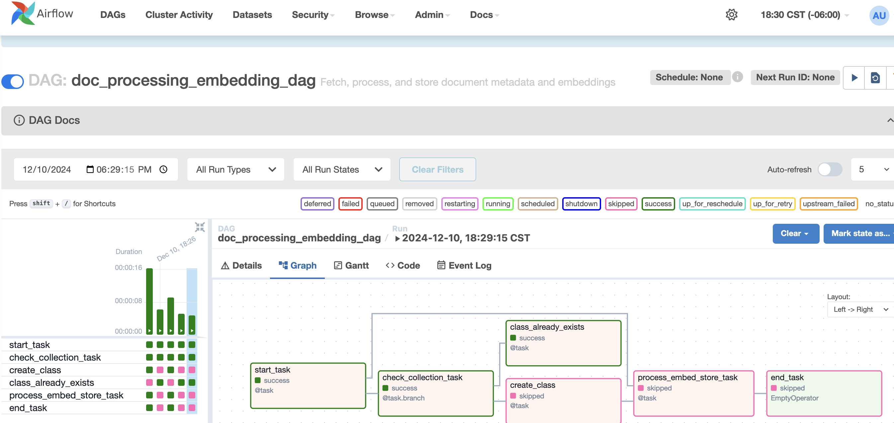
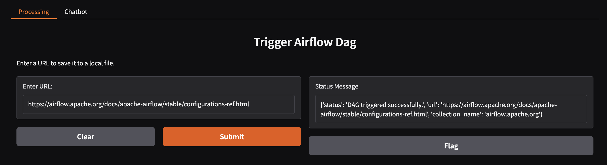
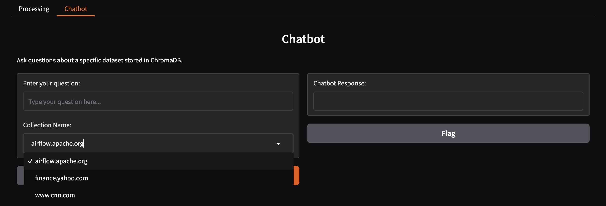
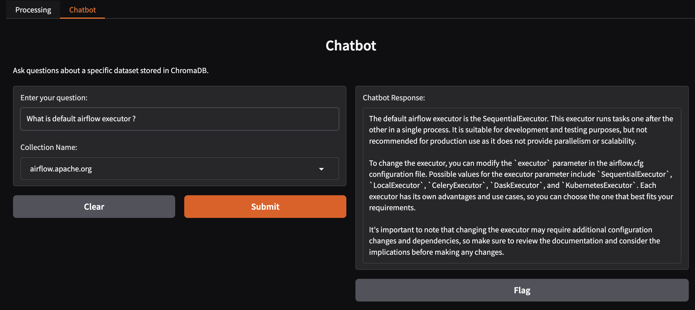

## Gen AI  RAG Using Airflow and Gradio

This project is a RAG-based (Retrieval-Augmented Generation) chatbot that allows users to upload a URL, which is then parsed and stored in a vector database. The stored collection is utilized to query user questions, with data retrieved dynamically from the vector database to provide relevant answers. The system leverages Apache Airflow for workflow orchestration, Gradio for the interactive user interface, and the OpenAI API for embedding and chat functionalities. The entire process is orchestrated efficiently using Docker containers and custom-built Airflow DAGs, offering a modular and scalable solution.
 

## Project Structure

 

- `dags/`: Contains Airflow DAGs and related utilities for document splitting and embedding.

- `include/`: Contains the Gradio application and its dependencies, including the data chatbot.

- `chromadb/`: Directory for Chroma DB data.

- `Dockerfile`: Custom Dockerfile for building the Airflow image.

- `docker-compose.yml`: Docker Compose file for setting up the Airflow, PostgreSQL, and Gradio services.

 

## Prerequisites

 

- Docker

- Docker Compose

 

## Setup Instructions

 

### 1. Clone the Repository

 

```sh

git clone https://github.com/BShraman/genAIUsingAirflow.git

cd genAIUsingAirflow

```

 

### 2. Build the Custom Docker Image

 

Build the custom Docker image for Airflow:

 

```sh

docker build -t custom-airflow:latest .

```

 

### 3. Configure Environment Variables

 

Create a `.env` file in the root directory and add the required environment variables:

 

```env

POSTGRES_IMAGE=bitnami/postgresql:14

POSTGRES_USER=airflow

POSTGRES_PASSWORD=airflow

POSTGRES_DB=airflow

AIRFLOW_IMAGE=custom-airflow:latest

```

 

### 4. Start the Services

 

Use Docker Compose to start the Airflow, PostgreSQL, and Gradio services:

 

```sh

docker-compose up -d

```

 

### 5. Access the Airflow Web UI

 

Open your web browser and navigate to [http://localhost:8080](http://localhost:8080) to access the Airflow web UI.

 

### 6. Access the Gradio Web UI

 

Open your web browser and navigate to [http://localhost:7860](http://localhost:7860) to access the Gradio web UI.

 

## Project Components

 

### Airflow DAGs

 

The `dags/` directory contains Airflow DAGs and related utilities for document splitting and embedding.

 

### Gradio Application

 

The `include/gradio` directory contains the Gradio application.

 
## UI Screenshots

### Airflow Web UI

The Airflow Web UI allows you to manage and monitor the workflows efficiently. Below is a screenshot of the Airflow dashboard where you can view and trigger your DAGs.



### Gradio Chatbot UI

The Gradio interface is used for interacting with the RAG-based chatbot. Users can upload URLs, which will be embedded and store in vectordb. The chatbot will respond to queries based on the Collection store in the vector database. Below is a screenshot of the Gradio UI where users can input their questions.






## Troubleshooting

 

If you encounter any issues, check the logs of the Docker containers:

 

```sh

docker logs airflow_webserver

docker logs postgres

docker logs gradio_app

```

## Contributing

 

Contributions are welcome! Please open an issue or submit a pull request.
